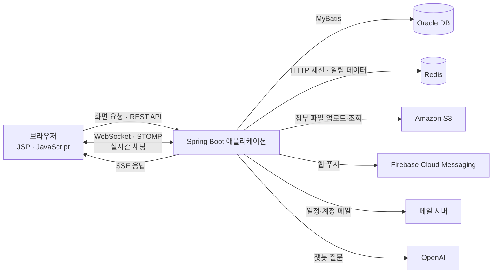

# Trioffice

**Trioffice**는 기업 내부 구성원이 대화하고 일정을 조율할 수 있는 협업 서비스입니다. 메신저를 중심으로 조직도, 일정, 파일 관리, 알림, AI 챗봇을 한 화면에서 사용할 수 있도록 만든 프로젝트입니다. 관리자가 부서와 사원 계정을 관리하고, 사원은 로그인 후 동료와 협업합니다.

## 서비스에서 할 수 있는 일

| 기능 | 설명 |
| --- | --- |
| 채팅 | 1:1·그룹 채팅, 채팅방 생성·퇴장·즐겨찾기, 메시지 읽음 상태와 이모티콘 반응을 지원합니다. 이전 메시지는 스크롤할 때 추가로 불러옵니다. |
| 일정 | 개인 일정을 등록·수정·삭제하고 다른 사원을 초대할 수 있습니다. 초대받은 사원은 참석 여부를 선택하고, 동료의 일정도 조회할 수 있습니다. |
| 조직도·사원 | 계층형 부서 구조와 사원 정보를 조회합니다. 관리자는 부서와 사원 정보를 관리할 수 있습니다. |
| 파일 관리 | 채팅방에서 이미지와 파일을 전송하고, 파일에 태그를 붙일 수 있습니다. 채팅방별 파일 조회와 전체 첨부 파일 조회를 제공합니다. |
| 검색·알림 | 사원과 채팅방을 검색합니다. 채팅·일정 관련 알림은 서비스 화면과 웹 푸시로 전달합니다. |
| AI 챗봇 | Spring AI와 OpenAI를 이용해 질문에 답합니다. 응답은 SSE로 브라우저에 순차적으로 표시됩니다. |

## 아키텍처



### 요청 처리 방식

1. **화면과 일반 기능:** Spring MVC가 JSP 화면을 제공하고, 브라우저의 JavaScript가 REST API를 호출합니다. 서버 코드는 기능별 `controller → service → mapper` 구조로 나뉘며, MyBatis 매퍼가 Oracle DB에 접근합니다.
2. **실시간 채팅:** 브라우저가 WebSocket/STOMP 엔드포인트에 연결합니다. 채팅 메시지는 서버에서 저장·처리한 뒤 구독 중인 사용자에게 전달됩니다. 채팅방 상세 조회는 별도 API로 이전 메시지를 나누어 가져옵니다.
3. **첨부 파일:** 파일은 Amazon S3에 업로드하고, 채팅 메시지·파일 정보·태그는 DB에서 관리합니다. 파일 조회 및 다운로드 기능은 서버 API를 통해 제공됩니다.
4. **세션과 알림:** Spring Security가 로그인과 권한을 처리하고, Spring Session이 HTTP 세션을 Redis에 저장합니다. 채팅·일정 알림에는 Firebase Cloud Messaging을 사용합니다.
5. **챗봇:** 서버가 Spring AI를 통해 OpenAI에 질문을 전달합니다. 생성된 답변은 채팅 내역에 저장되고 SSE로 브라우저에 표시됩니다.

## 기술 스택

| 영역 | 기술 |
| --- | --- |
| 화면 | JSP, HTML/CSS, JavaScript, jQuery |
| 서버 | Java 17, Spring Boot 3.3.4, Spring MVC, Spring Security |
| 실시간 통신 | Spring WebSocket, STOMP, SSE |
| 데이터 | Oracle DB, MyBatis 3.0.3, Redis, Spring Session |
| 외부 연동 | Amazon S3, Firebase Cloud Messaging, Spring Mail, Spring AI/OpenAI |
| 빌드·배포 | Maven, WAR, Docker, GitHub Actions |

## 프로젝트 구조

```text
src/main/java/com/kcc/trioffice/
├── domain/
│   ├── chat_room/              # 채팅방과 메시지
│   ├── chat_status/            # 읽음 상태와 이모티콘 반응
│   ├── attached_file/          # 파일 전송과 통합 조회
│   ├── schedule/               # 일정과 초대
│   ├── department/             # 조직도와 부서
│   ├── employee/               # 사원 계정과 프로필
│   ├── notification/           # 서비스 알림과 FCM 푸시
│   └── common/                 # 검색, 챗봇, 메일 등 공통 기능
└── global/                     # 보안, 세션, WebSocket, S3 등 공통 설정
src/main/resources/mapper/      # MyBatis SQL 매퍼
src/main/webapp/WEB-INF/views/  # JSP 화면
```

기능별 패키지에는 주로 컨트롤러, 서비스, DTO, 매퍼가 들어 있습니다. 화면 관련 코드는 `src/main/webapp` 아래에 있으며, Maven 설정과 의존성은 루트의 `pom.xml`에서 확인할 수 있습니다.

## 배포와 실행 환경

`develop` 브랜치에 변경사항이 올라오면 GitHub Actions가 Java 17 환경에서 WAR 파일을 빌드하고 Docker 이미지를 게시합니다. 이후 자체 호스팅 러너에서 배포 스크립트를 실행합니다. 관련 설정은 `.github/workflows/work.yml`과 `Dockerfile`에 있습니다.

`application.yml`, Firebase 서비스 계정 파일 등 실행에 필요한 설정은 저장소에 포함되어 있지 않습니다. 배포 과정에서는 GitHub Actions의 비밀 값으로 해당 파일들을 생성합니다. 로컬에서 실행하려면 Oracle DB, Redis 및 사용하는 외부 서비스의 설정과 인증 정보를 별도로 준비해야 합니다.
